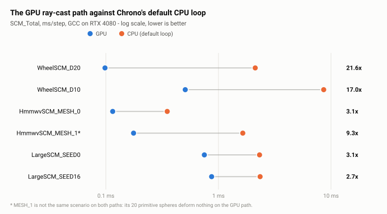
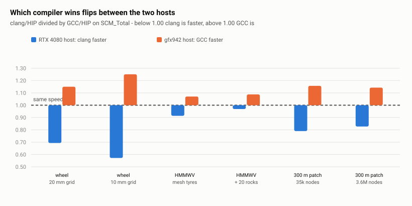
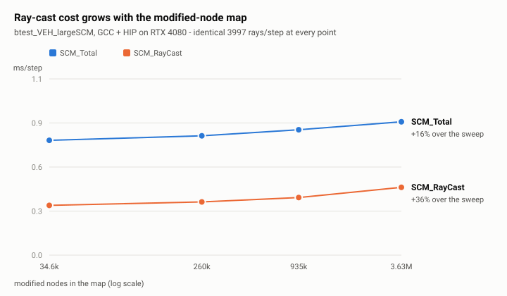

# SCM scaling benchmarks

Three benchmark programs covering the range SCM is used over, and a recorded baseline on NVIDIA and
AMD so a change to SCM can be judged without re-running everything on every platform.

| | test | vehicle | patch | grid spacing |
|---|---|---|---|---|
| small | `btest_VEH_wheelSCM` | one Polaris wheel on a test rig | 10 x 1 m | 0.02 / 0.01 m |
| medium | `btest_VEH_hmmwvSCM` | HMMWV, four wheels | 50 x 50 m | 0.05 m |
| large | `btest_VEH_largeSCM` | HMMWV, four wheels | 300 x 300 m | 0.02 m |

Each test has variants, and the tables below use their benchmark-suite names. What they mean:

| variant | what it changes | nodes deformed |
|---|---|---|
| `WheelSCM_D20` | 20 mm grid under the wheel | 1.7k |
| `WheelSCM_D10` | 10 mm grid -- four times as many nodes over the same ground | 7.2k |
| `HmmwvSCM_MESH_0` | four `RIGID_MESH` tyres, nothing else on the terrain | 5.4k |
| `HmmwvSCM_MESH_1` | the same, plus 20 spheres dropped on the soil | 5.4k GPU / 8.9k CPU |
| `LargeSCM_SEED0` | no pre-worked ruts: only what the vehicle itself digs | 34.6k |
| `LargeSCM_SEED1` | 1 rut laid into the node map before the run | 260k |
| `LargeSCM_SEED4` | 4 ruts | 935k |
| `LargeSCM_SEED16` | 16 ruts | 3.63M |

The `SEED` number is how many pre-worked ruts are written into the modified-node map at setup, which
is how the large test reaches a map size that would otherwise take hours of driving. The number of
ruts is the only difference between them -- same vehicle, same patch, same route -- so the spread
across `SEED0` to `SEED16` is what map size alone costs.

`btest_VEH_hmmwvSCM` also registers `CYL_0` and `CYL_1`, the same runs with `RIGID` cylinder tyres.
They are not benchmarked here: the GPU ray-cast path accepts only triangle-mesh collision shapes, so
a cylinder tyre silently falls back to the CPU and the cell would not measure what its label claims.

## What the baseline shows

**1. The GPU ray-cast path costs 2.7x to 22x less than Chrono's default CPU loop** on
`SCM_Total`. Part of that is a faster ray cast and part is fewer rays -- see finding 4 for the split.

<picture>
  <source media="(prefers-color-scheme: dark)" srcset="img/scm-gpu-vs-cpu-dark.svg">
  
</picture>

**2. CUDA and HIP are interchangeable. The host compiler is not, and which one wins depends on the
platform.** No CUDA/HIP pair differs by more than 1.6%. On the RTX 4080 clang beats GCC on
`SCM_Total` by up to 43%; on gfx942 GCC beats clang on all six GPU cells by 7-25%. Both platforms
agree that `SCM_RayCast` is compiler-neutral to within about 1% -- it is device code, so only the
host-side SCM work around it moves.

Each bar in the chart below divides one build by another; there is no single reference build. Blue is
`GCC/HIP` over `GCC/CUDA`, so it isolates the backend with the compiler held fixed. Orange and green
are `clang/HIP` over `GCC/HIP`, isolating the compiler with the backend held fixed. 1.00 means the
two builds are identical and below 1.00 means the first is faster.

<picture>
  <source media="(prefers-color-scheme: dark)" srcset="img/scm-what-moves-it-dark.svg">
  
</picture>

**3. Cost rises with the size of the modified-node map, at constant work.** Ray count is 3997.2 per
step at every point below, so this growth is map size alone: `GetHeight()` is called once per
candidate node per step and probes a map that only ever grows. This is what a tiled or narrower node
store would remove, and `btest_VEH_largeSCM` exists to measure it.

<picture>
  <source media="(prefers-color-scheme: dark)" srcset="img/scm-scaling-dark.svg">
  
</picture>

**4. The GPU-vs-CPU ray-cast ratio is two effects, and they should be read apart.** The GPU path
culls nodes outside every mesh body's XY footprint before casting; the CPU loop does not. So part of
the win is issuing fewer rays and part is casting each one faster. The ray-count reduction is a
property of the algorithm and is identical on both platforms; the per-ray figure is the hardware.

RTX 4080, GCC:

| variant | rays CPU/GPU | raw `SCM_RayCast` | per ray | nodes CPU/GPU |
|---|---|---|---|---|
| `D20` | 4.63x | 53.8x | **11.6x** | 1.406 |
| `D10` | 4.39x | 77.7x | **17.7x** | 1.306 |
| `MESH_0` | 1.01x | 4.6x | **4.6x** | 1.012 |
| `MESH_1` | 5.54x | 7.4x | **1.3x** | 1.628 |
| `SEED0` | 1.01x | 5.6x | **5.6x** | 1.033 |
| `SEED16` | 1.01x | 4.2x | **4.1x** | 1.000 |

gfx942, GCC:

| variant | rays CPU/GPU | raw `SCM_RayCast` | per ray | nodes CPU/GPU |
|---|---|---|---|---|
| `D20` | 4.63x | 33.8x | **7.3x** | 1.406 |
| `D10` | 4.39x | 67.1x | **15.3x** | 1.306 |
| `MESH_0` | 1.01x | 4.3x | **4.3x** | 1.009 |
| `MESH_1` | 5.54x | 9.8x | **1.8x** | 1.650 |
| `SEED0` | 1.01x | 5.1x | **5.1x** | 1.034 |
| `SEED16` | 1.01x | 4.4x | **4.3x** | 1.000 |

Read `MESH_1` with care in both tables: its ray reduction is large because its 20 falling spheres are
primitives that the GPU path does not accept at all, so per-ray is where the honest number is.

# Baseline -- RTX 4080

i7-13700K (16 cores / 24 threads, 30 MiB L3), 62 GB. Release, `-O3 -march=native`, Chrono OpenMP
threads 4, container `atk/chrono:orb`. GCC 11.4.0 and AMD clang 22.0 (ships with ROCm 7.2.4).
CUDA 13.2.78; HIP columns are ROCm 7.2.4 with `CMAKE_HIP_PLATFORM=nvidia`.

GPU cells are the mean of 2 processes, `ref` and CPU of 1, each itself Google Benchmark's mean over
5 or 10 internal repetitions. Worst internal cv on `SCM_Total` was 3.21% (clang/CPU `MESH_0`); every
other cell was under 2%.

## Results, ms/step

Each cell is `SCM_Total` / `SCM_RayCast`.

| variant | GCC/CUDA | GCC/HIP | clang/CUDA | clang/HIP | GCC/ref | GCC/CPU | clang/CPU |
|---|---|---|---|---|---|---|---|
| `WheelSCM_D20` | 0.0971 / 0.0359 | 0.0982 / 0.0370 | 0.0694 / 0.0365 | 0.0681 / 0.0352 | 6.8687 / 6.7994 | 2.1204 / 1.9911 | 2.1706 / 2.0941 |
| `WheelSCM_D10` | 0.5046 / 0.0978 | 0.5070 / 0.1000 | 0.2897 / 0.0975 | 0.2899 / 0.0975 | - | 8.6116 / 7.7662 | 8.2832 / 7.8633 |
| `HmmwvSCM_MESH_0` | 0.1152 / 0.0628 | 0.1149 / 0.0629 | 0.1063 / 0.0635 | 0.1050 / 0.0634 | 6.1585 / 6.0965 | 0.3506 / 0.2925 | 0.4024 / 0.3513 |
| `HmmwvSCM_MESH_1` | 0.1780 / 0.1229 | 0.1761 / 0.1214 | 0.1649 / 0.1193 | 0.1632 / 0.1201 | 6.2126 / 6.1485 | 1.6448 / 0.8998 | 1.6400 / 1.0522 |
| `LargeSCM_SEED0` | 0.7514 / 0.3260 | 0.7493 / 0.3248 | 0.6008 / 0.3288 | 0.5918 / 0.3261 | 34.3628 / 33.9085 | 2.3183 / 1.8237 | 2.2628 / 1.9392 |
| `LargeSCM_SEED1` | 0.7891 / 0.3516 | 0.7786 / 0.3473 | 0.6425 / 0.3615 | 0.6298 / 0.3537 | - | 2.3377 / 1.8418 | 2.3180 / 1.9865 |
| `LargeSCM_SEED4` | 0.8075 / 0.3669 | 0.8182 / 0.3757 | 0.6408 / 0.3641 | 0.6332 / 0.3611 | - | 2.3303 / 1.8351 | 2.3086 / 1.9833 |
| `LargeSCM_SEED16` | 0.8704 / 0.4431 | 0.8702 / 0.4427 | 0.7264 / 0.4524 | 0.7198 / 0.4516 | 34.5411 / 34.0860 | 2.3447 / 1.8498 | 2.3022 / 1.9782 |

## Work per step

Two cells did the same work if their **deformed-node counts** agree. Ray counts do not
compare across paths -- see the caveats.

| variant | path | SCM_Rays | SCM_Nodes |
|---|---|---|---|
| `D20` | GPU (all four cells) | 363.2 | 1717 |
| `D20` | ref | 1680.4 | 1717 |
| `D20` | CPU | 1681.7 | 2414 |
| `D10` | GPU (all four cells) | 1518.9 | 7162 |
| `D10` | CPU | 6665.4 | 9352 |
| `MESH_0` | GPU (all four cells) | 637.2 | 5420 |
| `MESH_0` | ref | 646.3 | 5422 |
| `MESH_0` | CPU | 641.6 | 5474 |
| `MESH_1` | GPU (all four cells) | 645.2-684.1 | 5420 |
| `MESH_1` | ref | 646.3 | 5422 |
| `MESH_1` | CPU | 3572.3-3612.6 | 8811-9020 |
| `SEED0` | GPU (all four cells) | 3995.7-3997.2 | 34557-34587 |
| `SEED0` | ref | 4052.5 | 34601 |
| `SEED0` | CPU | 4024.9 | 35724 |
| `SEED1` | GPU (all four cells) | 3995.7-3997.2 | 259572-259602 |
| `SEED1` | CPU | 4024.9 | 260739 |
| `SEED4` | GPU (all four cells) | 3995.7-3997.2 | 934617-934647 |
| `SEED4` | CPU | 4024.9 | 935784 |
| `SEED16` | GPU (all four cells) | 3995.7-3997.2 | 3634797-3634827 |
| `SEED16` | ref | 4052.5 | 3634841 |
| `SEED16` | CPU | 4024.9 | 3635964 |

## Memory -- resident set after setup, MiB

| build | `SEED0` | `SEED16` | delta |
|---|---|---|---|
| GCC (any backend) | 1862.1 | 2457.0 | 594.9 |
| clang/HIP | 1864.1 | 2458.9 | 594.9 |
| clang/CUDA | 2085.1 | 2680.0 | 594.8 |

The delta is what 3.60M added nodes cost: 165 B/node, against a 128-byte `NodeRecord` plus
`unordered_map` overhead and allocator rounding. It is the same in every build; only the constant
offset moves, and most of that offset is the base-height matrix -- 15001^2 entries at 8 bytes is
1716.8 MiB.

# Baseline -- gfx942 (MI300X)

EPYC 9684X, 16-core slice, 233 GB. ROCm 7.2.4, HIP backend, GCC 11.4.0 and ROCm clang 22.0.0git.
Release, benchmarks set 4 Chrono OpenMP threads internally. All cv <= 0.18%. One process per cell.

Each cell is `SCM_Total` / `SCM_RayCast`.

| variant | GCC/HIP | GCC/CPU | clang/HIP | clang/CPU |
|---|---|---|---|---|
| `WheelSCM_D20` | 0.1726 / 0.0939 | 3.3830 / 3.1726 | 0.1985 / 0.0971 | 3.4522 / 3.2355 |
| `WheelSCM_D10` | 0.6863 / 0.1882 | 13.8749 / 12.6312 | 0.8582 / 0.2036 | 13.7305 / 12.4352 |
| `HmmwvSCM_MESH_0` | 0.2214 / 0.1464 | 0.7856 / 0.6282 | 0.2370 / 0.1501 | 0.6313 / 0.5076 |
| `HmmwvSCM_MESH_1` | 0.3172 / 0.2387 | 3.7637 / 2.3370 | 0.3394 / 0.2481 | 4.0699 / 2.4669 |
| `LargeSCM_SEED0` | 1.1186 / 0.5670 | 3.5594 / 2.8957 | 1.2941 / 0.5868 | 4.7062 / 3.4875 |
| `LargeSCM_SEED16` | 1.3809 / 0.8256 | 4.7167 / 3.6066 | 1.5779 / 0.8656 | 4.8605 / 3.6381 |

Resident set after setup, MiB: `SEED0` 2366 GPU / 1745 CPU, `SEED16` 2961 GPU / 2340 CPU. The
595 MiB node-storage delta matches the NVIDIA host exactly; the GPU builds carry ~620 MiB more
constant offset than the CPU-only builds.

Ray and node counts agree with the RTX 4080 host to the digit on every variant -- 363.2 / 1681.7
rays on `D20`, 1518.9 / 6665 on `D10`, 3995.8 / 4025 on the `SEED` pair -- so the two platforms ran
the same work and the columns are directly comparable.

## The two hosts side by side

`SCM_Total` in ms/step, GCC on both, so the only variable is the machine:

| variant | GPU 4080 | GPU gfx942 | CPU 4080 | CPU gfx942 |
|---|---|---|---|---|
| `D20` | 0.0982 | 0.1726 | 2.1204 | 3.3830 |
| `D10` | 0.5070 | 0.6863 | 8.6116 | 13.8749 |
| `MESH_0` | 0.1149 | 0.2214 | 0.3506 | 0.7856 |
| `MESH_1` | 0.1761 | 0.3172 | 1.6448 | 3.7637 |
| `SEED0` | 0.7493 | 1.1186 | 2.3183 | 3.5594 |
| `SEED16` | 0.8702 | 1.3809 | 2.3447 | 4.7167 |

The 4080 is ahead everywhere: 1.4-1.9x on the GPU path, 1.5-2.2x on the CPU path. That is the
expected shape rather than a surprise. These are small kernels -- a few hundred to a few thousand
rays per step -- where a high-clocked consumer part beats a datacenter GPU built for wide parallel
work, and a shared 16-core EPYC slice loses to a 5.3 GHz Raptor Lake on a four-thread CPU path.

# Caveats

- **`SCM_Rays` is a control within a path, never across paths.** The GPU path discards nodes outside
  every mesh body's XY footprint before counting
  ([`SCMTerrainRaycastGpu.cpp`](../../../chrono_vehicle/terrain/SCMTerrainRaycastGpu.cpp), the
  `in_footprint` test); the CPU loop does not. Those rays could not have hit anything, so both paths
  find the same hits from different ray counts -- 363 against 1682 on `D20`. Compare `SCM_Nodes`.

- **GPU and CPU are not always the same scenario.** The GPU path accepts only triangle-mesh
  collision shapes. `MESH_1`'s 20 falling spheres are primitives, so on the GPU path they deform
  nothing: 5416 nodes against the CPU loop's ~8900. `MESH_0` (1.01x) and `SEED16` (1.00x) show the
  paths agreeing wherever every collidable is a mesh. This is a real functional gap, not a
  measurement artifact.

- **`ref` carries no speedup claim.** It reproduces the GPU path's physics on the CPU, which is what
  makes the node-count agreement meaningful, but it is a validation aid and runs several times
  slower than the production CPU loop. `D10` has no `ref` cell: ~50 min for a column that compares
  nothing.

- **Total step time is not a measure of SCM work.** In the wheel test the constraint solver is a
  third of it. Use `SCM_Total` and its breakdown (`SCM_Domains` / `SCM_RayCast` / `SCM_Patches` /
  `SCM_Forces` / `SCM_Bulldoze`) from `ScmBenchmarkUtils.h`.

- **One machine per platform.** L3 size is implicated in every ray-cast figure, and the AMD host is
  a shared slice.

- **No physics-parity test.** These measure cost, not correctness.

- **`SEED16`, at 3.63M nodes, exceeds any run actually performed.** Read it as trend, not workload.

# Reproducing

    cmake -S . -B build -G Ninja -DCMAKE_BUILD_TYPE=Release \
      -DCH_ENABLE_MODULE_VEHICLE=ON -DCH_ENABLE_MODULE_VEHICLE_MODELS=ON \
      -DBUILD_BENCHMARKING=ON -DBUILD_DEMOS=OFF -DBUILD_TESTING=OFF
    cmake --build build -j --target btest_VEH_wheelSCM btest_VEH_hmmwvSCM btest_VEH_largeSCM

- Run from `build/bin`; Chrono resolves its data by relative path.
- `SCM_BENCH_RAYCAST=gpu|ref|cpu` picks the path, `gpu` by default. **Every run prints which one it
  got. Check that line.** A binary older than this variable ignores it silently and reports `gpu`,
  which is how a whole grid of "CPU" numbers can turn out to be GPU runs.
- One variant per process, and **anchor the filter**: `--benchmark_filter=SEED1/` matches only
  `SEED1`, where `SEED1` also matches `SEED16`. Google Benchmark rebuilds the fixture between
  repetitions and glibc does not return the freed matrix to the OS, so a combined run reports
  allocator retention as live data.
- Nothing else on the machine. A concurrent build moves these numbers by more than the effects they
  are meant to catch.
- Do not add an active domain to the wheel test. `ChWheelTestRig::CreateTerrainSCM` already declares
  one; a second casts the nodes under the wheel once per domain and inflates `SCM_Rays` without
  changing any physics.

# Why the large test is built the way it is

The modified-node map only grows -- a node enters on first contact and is never evicted -- so in a
long run its size reflects ground covered, not ground under a wheel; a 13.7 h two-rover run reached
~891k entries. Seeding gets there in under a second and isolates map size from how it got large.
The patch comes from a height map rather than `Initialize(sizeX, sizeY, delta)` because a flat patch
allocates no base-height matrix at all and so cannot measure one. Seeded ruts are 15 nodes wide at
rows 2003 + 114k: neither offset nor pitch is a power of two, so no storage scheme is flattered by
the layout.
